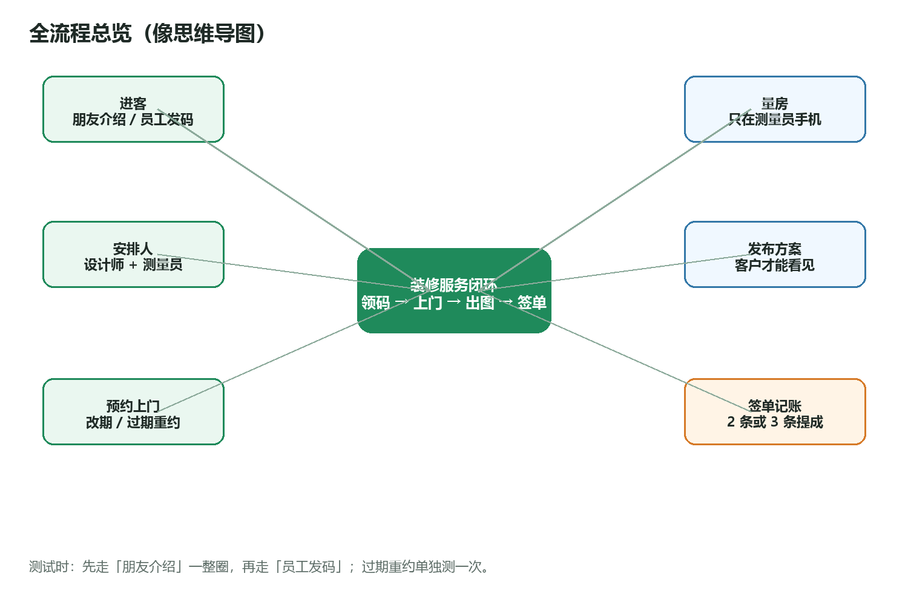
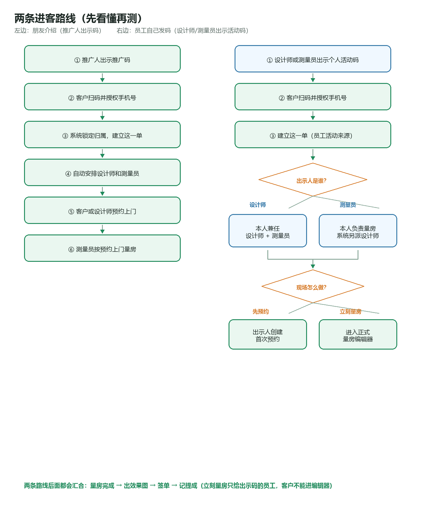
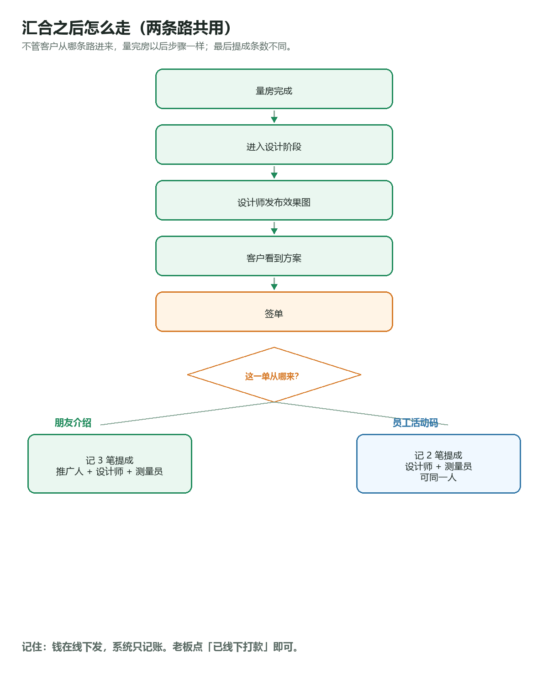

# 装修服务内测 · 所有人先看

先读这一份。读完后，按组织者发给你的角色，再打开对应的「角色说明书」。

- Word 总册：`docs/internal-test/装修服务内测-所有人先看.docx`
- 角色说明书：同目录下 `装修服务内测-角色-*.docx`

仓库对照 Markdown 在本文件夹；发给同事请用 Word。

---

## 1. 今天测什么

我们在测一套给装修公司用的工具：

1. 有人介绍客户，或员工自己在外面发码  
2. 客户用微信领免费上门量房和设计  
3. 约时间上门、量房子、出效果图、签单  
4. 公司记账：该给推广人、设计师、测量员多少提成（钱在线下发，系统只记账）

你的任务：**按角色说明书点一遍，看实际好不好用。**  
每做完一步打勾；和说明书不一样，就截整屏图发到群里。

账号、网页地址、进哪家公司，由组织者另发。说明书里没有密码。

---

## 2. 怎么读（很重要）

```text
① 所有人先看完本文（大约 10 分钟）
② 组织者告诉你扮演谁
③ 只打开你的那一份角色说明书
④ 测的时候对照「流程图」看自己走到哪一步
```

| 你扮演谁 | 再打开哪一份 |
| --- | --- |
| 老板 / 店长（张总） | `角色-老板` |
| 设计师（小美） | `角色-设计师` |
| 测量员（阿强） | `角色-测量员` |
| 推广人（老周） | `角色-推广人` |
| 客户（李女士 / 王先生） | `角色-客户` |
| 一个人串完全场 | 先看本文流程图，再按顺序拿齐各角色说明书 |

---

## 3. 故事人物（记住这几个称呼）

| 称呼 | 扮演 | 一句话 |
| --- | --- | --- |
| 张总 | 老板 | 发入职码、看进度、签单记账 |
| 小美 | 设计师 | 补微信资料、预约、出效果图、发布 |
| 阿强 | 测量员 | 上门量房、看日程 |
| 老周 | 推广人 | 出示推广码、看脱敏进度和收益 |
| 李女士 | 客户 1 | 扫老周的码（朋友介绍） |
| 王先生 | 客户 2 | 扫员工活动码（必须换一个微信） |

---

## 4. 全流程总览（思维导图）



一句话：**领码 → 安排人 → 预约上门 → 量房 → 发布方案 → 签单记账。**

---

## 5. 两条进客路线

客户可以从两条路进来，后面大部分步骤相同，**提成条数不同**。



### 路线 A：朋友介绍（必测）

推广人出示推广码 → 客户扫码授权 → 系统安排设计师和测量员 → 预约 → 量房 → 出图 → 签单 → **记 3 笔提成**（推广人 + 设计师 + 测量员）

给客户看的推广码画面上 **故意没有公司名**，这不是漏做。

### 路线 B：员工活动码（也要测）

设计师或测量员出示个人活动码 → 客户扫码授权 → 出示人锁定为测量侧（设计师出示则本人兼任设计师+测量员；测量员出示则本人量房、系统另派设计师）→ **出示人**可先预约或立刻量房 → 出图 → 签单 → **只记 2 笔提成**（没有推广人；同一人兼任时两行可以是同一个人）

注意公司和名字出现在哪：

- **员工出示活动码**那一页：可以出现装修公司名  
- **客户扫码后的领取/授权页**：仍然 **没有** 装修公司名（和推广人推广码一样）；成功页只给设计师个人微信  

老周的进度/收益里 **看不到** 这一单。

> 同一客户如果已有进行中的服务（未关闭、未归档），再扫别的码不会换公司、不会新建单。所以王先生必须是另一个微信。

---

## 6. 汇合之后（共用）



```text
量房完成
   ↓
设计师发布效果图（不发布，客户看不见）
   ↓
签单
   ↓
朋友介绍 → 3 笔提成　｜　员工活动码 → 2 笔提成
```

---

## 7. 这些词是什么意思

| 说明书里写 | 平常可以当成 |
| --- | --- |
| 后台 | 电脑浏览器打开的管理网页 |
| 小程序 | 手机微信里的这个应用 |
| 入驻 | 第一次扫公司的码，加入这家公司 |
| 授权手机号 | 微信弹出「允许使用手机号」，点允许 |
| 推广服务码 | 推广人给客户扫的码（无公司名） |
| 活动码 | 员工给客户扫的码（可有公司名） |
| 这一单 | 这一户人家的服务记录 |
| 当前进度 | 屏幕上「已预约」「已过期」等字样，请看这行 |
| 底部那一排 | 手机最下面的按钮 |

---

## 8. 手机底下应该出现什么

| 身份 | 底下应有 |
| --- | --- |
| 客户 | 服务、我的 |
| 推广人 | 推广、进度、收益、我的 |
| 设计师 | 工作台、客户、设计、收益、我的 |
| 测量员 | 工作台、客户、收益、我的 |
| 老板 | 经营、客户、预约、提成、我的 |

对不上，先截图问组织者。

---

## 9. 这些不是毛病，不要当故障报

1. 推广人推广码、以及客户扫活动码后的领取/授权页，都没有装修公司名；公司名只出现在员工「出示活动码」那一页  
2. 客户不能自己取消预约  
3. 电脑网页不能量房（只在测量员手机；客户也不能进量房编辑器）  
4. 有时写着「量房中」，旁边进度却是「预约已过期」——请看进度那几个字  
5. 员工活动码来的客户，没有推广人提成，老周也看不到  
6. 老板身份不能直接量房/出图，要切换成设计师或测量员  
7. 系统不转账，只记账；手机「提成」可点已付，改金额/换人仍在电脑后台  
8. 没点「发布」的效果图，客户看不见  
9. 测试版小程序码扫不进正式版；换环境要重新出码  
10. 页面状态对了，但微信没弹通知——先看有没有允许订阅  

---

## 10. 发现问题怎么发群

```text
我现在扮演：客户 / 推广人 / 设计师 / 测量员 / 老板 / 电脑后台
用的微信号或后台登录名：（不要发验证码）
我点了：1. …  2. …  3. …
说明书里写应该：……
我实际看到：……
截图：整屏
大约时间：例如 8月21日 14:32
```

- **马上要修**：领不了、排不到人、约不上、量房丢了、看到别人隐私、签单没提成  
- **尽快修**：进度文字不对、过期还占日程、经营看不到异常、身份进错首页  
- **可以稍后**：错别字、间距、通知没收到但页面是对的  

---

## 11. 下一步

组织者分配角色后，请打开你的角色说明书开始打勾。  
串场的人：先完成路线 A，再路线 B，再单独测一次「预约过期重约」。
