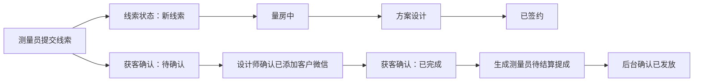

# 测量员—设计师双轨获客协作工作台实施方案

状态：`Implemented`

批准日期：2026-08-10

实施日期：2026-08-10

界面细化确认：2026-08-10（客户线索设计师入口、通用设计师名片弹层、线索详情正式量房信息层级、测量员协作页唯一设计师入口）

本文档记录已经落地的双轨设计：将“已获客”从线索主流程状态中移除，改为独立的获客确认事实，并新增角色化“获客协作”工作台。

当前运行时实现、数据合同和已知限制仍以代码、`docs/measurer-designer-acquisition.zh-CN.md` 及中英文模块清单为准；本文保留为已批准方案和验收依据。

## 1. 背景与问题

当前线索主流程为：

```text
新线索 → 已获客 → 量房中 → 方案设计 → 已签约
```

这种设计会误导用户认为“必须先确认已获客，才能开始量房”。实际业务含义是：

- 线索状态用于表示客户业务推进阶段。
- 获客确认用于判断测量员是否完成“让客户添加设计师微信”的交接任务。
- 获客确认成功后生成测量员提成，但不应阻塞量房、设计或签约。

因此必须把业务推进、获客确认和提成结算拆成三个独立维度。

## 2. 目标状态模型

| 维度 | 状态 | 用途 |
| --- | --- | --- |
| 线索业务状态 | `new → measuring → designing → converted`；`closed` 为终止状态 | 表示客户当前业务推进阶段 |
| 获客确认 | `pending_confirmation` / `confirmed` | 表示测量员微信交接任务是否完成 |
| 提成结算 | `pending_settlement → paid`；异常为 `voided` | 表示获客提成是否生成、是否发放 |

三个维度相互独立：



## 3. 核心业务规则

### 3.1 线索推进

- 新线索可以直接开始量房，不要求先完成获客确认。
- 规范主状态调整为 `new`、`measuring`、`designing`、`converted`、`closed`。
- `acquired` 不再作为新写入的 `leads.status`。
- 历史状态 `contacted`、`measured`、`assigned`、`quoting` 继续按现有兼容规则归并展示。

### 3.2 获客确认

- 获客确认不新增必须持久化的状态字段，优先通过现有 `acquired_at` 判断：

  ```ts
  acquisitionStatus = acquiredAt ? 'confirmed' : 'pending_confirmation';
  ```

- API/DTO 可以返回计算字段 `acquisitionStatus`，但数据库事实仍以 `acquired_at`、`acquired_by` 为准。
- 仅线索的负责设计师可以确认。
- `new`、`measuring`、`designing`、`converted` 均允许确认。
- 普通设计师不能对已关闭且尚未确认的线索补确认；异常补录由后续管理员纠错入口处理。
- 线索已经确认获客后，即使后续关闭，也不自动取消测量员提成。
- 重复确认、双击或并发请求只能成功一次。

### 3.3 提成

- 设计师确认成功后生成唯一 `lead_acquisition_commissions` 记录。
- 金额继续使用设计师确认时的企业固定金额快照。
- 初始状态为 `pending_settlement`，后台人工结算为 `paid`。
- 获客工作台只显示提成摘要和结果；完整财务明细继续进入“我的提成”。

## 4. 信息架构

### 4.1 客户线索页

客户线索页只负责业务推进，不同时展示两套状态轴。

删除：

- “已获客”主状态。
- “已获客”筛选项。
- 线索卡片上的第二个获客状态标签。
- “已获客后才能量房”的下一步提示。

保留：

- 新线索、量房中、方案设计、已签约、已关闭。
- 搜索、业务状态筛选、线索详情和量房入口。
- 测量员的绑定设计师微信资料，但应放在角色化协作入口或详情中，避免挤压高频线索卡片。

#### 4.1.1 已确认的客户线索页面设计锁

`pages/leads-management/leads-management` 必须继续以已批准的 C 版“客户档案簿”为视觉与结构基准，保持以下首屏顺序：

```text
微信胶囊安全区
→ 客户线索标题与小 K 客户管家场景
→ 绿色档案摘要
→ 搜索 / 筛选 / 新增客户
→ 业务状态索引
→ 客户档案卡片
```

- 禁止再次把完整的“绑定设计师”资料卡、微信号或大二维码插在线索列表顶部、标题和绿色档案摘要之间；这类次级联系信息不得改变原设计的首屏节奏。
- 测量员且接口返回授权的 `designerProfile` 时，在微信胶囊下方的安全内容通道右侧显示轻量入口 `我的设计师`。入口不得与胶囊、标题、小 K 场景、绿色档案摘要或高频搜索操作重叠。
- 该入口是上下文工具，不是新的主按钮、统计卡或悬浮操作；不得使用整行横幅、全宽卡片或第二块强绿色区域。
- 设计师、普通用户或没有授权设计师资料的角色不显示该入口，也不渲染占位二维码或假资料。
- 本地交互参考为 `design-references/lead-designer-contact-sheet-v1.png`。参考图只说明入口、底部弹层和详情复用关系；本节文字、真实代码、权限和数据契约优先于参考图中的示例数据。

### 4.2 新增获客协作入口

不增加底部 Tab。获客协作只对测量员和设计师有意义，不应占用所有用户的一级导航。

入口：

- “我的 → 我的工作台”增加角色化“获客协作”。
- 新线索站内/微信通知直接进入获客协作任务。
- 获客确认与提成通知直接进入对应协作记录。

建议页面：

```text
/packages/business/acquisition-center/acquisition-center
```

建议深链：

```text
/packages/business/acquisition-center/acquisition-center?leadId=<leadId>
```

### 4.3 通用设计师名片弹层

新增主包共享组件，建议路径：

```text
/components/designer-contact-sheet/designer-contact-sheet
```

主包线索页和 `packages/business` 分包页面统一调用这一组件，不得分别实现不同的二维码卡片或弹窗。入口文案按当前任务变化，但弹层内容和行为一致：

| 调用位置 | 入口文案 | 用途 |
| --- | --- | --- |
| 客户线索页 | `我的设计师` | 查看测量员当前绑定设计师 |
| 线索详情“获客协作”信息组 | `联系设计师` | 查看该线索创建时归属的设计师 |
| 测量员获客协作页 | `我的设计师` / `查看微信` | 查看测量员当前唯一绑定设计师；入口在汇总区之后、任务筛选之前只出现一次 |

- 弹层采用移动端模态底部抽屉，标题使用 `设计师名片`，从底部进入并保留底部安全区；不使用居中网页式大弹窗。
- 内容只包含真实授权数据：设计师姓名、角色说明、微信号、签名二维码、紧凑的复制入口、长按识别说明和清晰的关闭路径。
- `复制微信号` 是唯一强调操作；二维码和微信号缺失、签名地址过期、加载、失败与重试必须有真实状态，不能显示假二维码或空白大卡。
- 弹层只负责查看和复制，不提供绑定、换绑或编辑操作；标题禁止使用会暗示当前用户可以修改关系的 `绑定设计师`。
- 组件必须保留遮罩点击关闭、显式关闭按钮、触控尺寸、字号下限和二维码长按识别能力；打开和关闭不得改变列表筛选、滚动位置、线索状态或获客状态。
- 线索页和测量员获客协作页使用当前绑定的页面级 `designerProfile`；协作任务卡不得重复返回或展示微信号、二维码或“查看设计师微信”按钮。线索详情仍使用线索创建时的 `assignedTo` 设计师快照，两类数据不得因后续换绑而混用。

## 5. 设计师工作台

### 5.1 页面目标

设计师进入页面后只处理客户微信交接，不展示量房业务状态筛选。

### 5.2 页面结构

```text
┌─────────────────────────────┐
│ 获客协作                     │
│ 确认客户已添加微信，完成交接   │
├──────────────┬──────────────┤
│ 待我确认  3   │ 本月完成  12  │
└──────────────┴──────────────┘

[待确认]  [已完成]

┌─────────────────────────────┐
│ 王女士              今天 10:26│
│ 测量员：李师傅               │
│ 138****5201                  │
│ 请确认客户已经添加你的微信     │
│                             │
│ 查看客户线索   确认已添加微信  │
└─────────────────────────────┘
```

### 5.3 操作规则

- 主按钮文案：`确认已添加微信`。
- 次按钮文案：`查看客户线索`。
- 确认弹窗文案：

  > 确认后将认定测量员已完成本次获客交接，并生成一条待结算获客提成。此操作不会改变客户线索的量房或设计进度。

- 确认成功后任务进入“已完成”，显示确认时间和测量员信息。
- 操作必须有加载、成功、失败、重复确认和无权限反馈。

## 6. 测量员工作台

### 6.1 页面目标

测量员关注交接是否完成、绑定设计师资料以及获客提成结果。

### 6.2 页面结构

```text
┌─────────────────────────────┐
│ 获客协作                     │
│ 跟进客户微信交接与获客奖励     │
├─────────┬─────────┬─────────┤
│ 待确认 2 │ 已完成 8 │ 待结算 ¥80│
└─────────┴─────────┴─────────┘

[等待确认]  [已完成]

我的设计师  张设计师             [查看微信]

┌─────────────────────────────┐
│ 王女士             等待设计师确认│
│ 等待设计师确认客户微信交接       │
│                             │
│ 查看客户线索                  │
└─────────────────────────────┘
```

### 6.3 确认后的交接回执

```text
获客交接已确认
确认时间：2026-08-10 14:32
获客提成：¥10.00
结算状态：待结算
```

- 每个测量员只有一个当前绑定设计师；页面在汇总区之后提供一次“我的设计师 / 查看微信”，打开微信号和二维码信息。该入口在等待/已完成筛选和全部任务卡之间共享，不随任务数量重复。
- 客户任务卡不再展示设计师姓名、微信号、二维码入口或“查看设计师微信”按钮；历史负责人事实仍保留在服务端任务数据和线索详情中。
- “查看客户线索”进入现有线索详情。
- “查看提成”进入现有测量员获客提成页面。

## 7. 线索详情调整

详情页的主状态时间线只显示业务状态，不增加第二条状态轴。

增加普通信息分组：

```text
获客协作
设计师：张设计师
微信交接：已确认
确认时间：2026-08-10 14:32
联系设计师 >
查看协作记录 >
```

- 待确认时显示“等待设计师确认”或“去处理获客协作”。
- 设计师的确认主操作统一在获客协作工作台完成，线索详情只提供入口，避免多个页面存在不同确认规则。
- `联系设计师` 只对有权读取该设计师微信资料的测量员显示，并调用第 4.3 节的同一个设计师名片弹层；详情页不得再实现一套独立二维码卡片。
- 详情 Hero 继续只承载客户身份和业务状态。设计师联系入口归入“获客协作”普通信息组，不覆盖 Hero 场景，也不与正式量房主操作竞争。

### 7.1 正式量房卡信息层级

`whole-home-tab` 已经是正式量房卡的唯一栏目标题，因此不再显示 `whole-home-plan-name`，也不把自动生成的“正式量房 1”或完整时间戳作为第二个标题。

卡片只保留三层信息：

1. 栏目标题：`正式量房`。
2. 主要任务：`下一步` 与当前真实 `nextAction`。
3. 辅助元数据：
   - 无正式户型：`从墙图开始建立客户户型`。
   - 量房中：`量房中 · <闭合空间数>个空间 · <M月D日>更新`。
   - 已完成：`已完成 · <闭合空间数>个空间 · <M月D日>更新`。

空间数和更新时间必须来自当前正式 version-4 户型记录；没有空间数或有效日期时省略对应片段，禁止用占位值补齐。继续量房、开始量房、新增量房和删除行为保持现有真实能力与权限边界。

## 8. 小 K 角色与视觉方向

- 页面模式：`Operate`。
- 小 K 的唯一业务角色：`交接见证员`。
- 采用“客户档案交接/回执单”的业务隐喻。
- 小 K 只在页面头部或空状态说明一次规则，不在任务卡中反复装饰。
- 头部提示：

  > 客户添加设计师微信后，确认交接即可为测量员生成获客提成。

- 延续亮绿色、柔白表面和现有本地授权图标体系。
- `390x844` 必须保留微信右上角胶囊安全区。
- 主要文字和按钮不小于 `24rpx`，辅助信息不小于 `20rpx`，点击区域按项目规范处理。

## 9. API 与数据调整

### 9.1 `POST /api/leads/[id]/acquire`

调整为：

- 不再要求 `lead.status === 'new'`。
- 条件更新改为负责设计师匹配、`acquired_at IS NULL`，并拒绝未确认的 `closed` 线索。
- 只写入 `acquired_at`、`acquired_by` 和 `updated_at`。
- 不再写入 `status = 'acquired'`。
- 在同一事务创建唯一待结算提成和站内通知。
- 微信通知继续在事务提交后发送，失败不回滚业务数据。

### 9.2 获客任务查询

建议新增：

```text
GET /api/acquisition-tasks
```

能力：

- 按当前小程序员工角色返回角色化任务。
- 设计师只能读取自己负责的任务。
- 测量员只能读取自己录入的任务。
- 支持 `pending_confirmation`、`confirmed`、分页和时间筛选。
- 返回摘要：待确认数量、本月确认数量、待结算金额等当前角色真实可见数据。
- 使用共享 tenant helpers、Mini Program staff context 和 PostgreSQL RLS transaction。

### 9.3 DTO

线索 DTO 增加或统一：

```ts
{
  status: 'measuring',
  acquisitionStatus: 'confirmed',
  acquiredAt: '2026-08-10T06:32:00.000Z',
  acquiredBy: '...',
  acquisitionCommissionStatus: 'pending_settlement'
}
```

## 10. 历史数据迁移

1. `status = 'acquired'` 且存在 `acquired_at`：
   - 保留 `acquired_at`、`acquired_by`。
   - 主状态迁回 `new`。
2. 已推进到 `measuring`、`designing`、`converted` 且存在 `acquired_at`：
   - 主状态保持不变。
   - 获客确认继续从 `acquired_at` 派生。
3. 已存在获客提成但 `acquired_at` 为空：
   - 输出异常修复清单。
   - 不允许迁移脚本静默猜测确认时间。
4. 删除客户端和后台状态字典中的主状态 `acquired`。
5. 历史 API 传入 `status = 'acquired'` 时，应拒绝或作为明确的兼容确认动作处理，不能继续写入主状态。

迁移必须可重复执行，并使用迁移角色执行；运行中的 `sfp_app` 不能被授予 schema 迁移权限。

## 11. 后期获客统计口径

后续统计页面至少包含：

- 测量员提交线索数。
- 获客确认数。
- 待确认数和超时未确认数。
- 获客确认率。
- 平均确认耗时。
- 待结算金额和已发放金额。
- 按企业、测量员、设计师和日期汇总。

区分两个时间口径：

- 本期确认获客数：按 `acquired_at` 统计。
- 本期提交线索获客率：按 `created_at` 建立线索 cohort，再判断这些线索最终是否确认。

手机号去重会影响统计归属。开发统计前必须明确重复手机号由原线索创建人、当前提交人还是人工裁决获得归属；当前实现不得默认为一次重复提交生成第二条提成。

## 12. 状态矩阵

| 状态 | 设计师 | 测量员 |
| --- | --- | --- |
| 加载中 | 骨架屏，不显示假数量 | 骨架屏，不显示假金额 |
| 待确认 | 显示确认主按钮 | 页面级显示唯一绑定设计师；任务卡只显示等待说明 |
| 已确认 | 显示确认时间和测量员 | 显示交接回执和提成摘要 |
| 空状态 | “暂无待确认交接” | “暂无获客协作记录” |
| 请求失败 | 保留页面结构并提供重试 | 保留页面结构并提供重试 |
| 重复确认 | 刷新为已完成，不生成重复提成 | 显示最新回执 |
| 无权限/换绑历史 | 只读或明确拒绝 | 仍可查看创建时绑定设计师快照 |

## 13. 实施范围

预计涉及：

- `admin/src/app/api/leads/[id]/acquire/`
- `admin/src/app/api/leads/`
- `admin/src/app/api/acquisition-tasks/`
- `admin/src/db/schema.ts`
- `admin/src/db/repositories/lead-repository.ts`
- `admin/src/db/repositories/acquisition-repository.ts`
- `admin/src/db/postgres-dto.ts`
- `admin/drizzle/` 新迁移
- `admin/src/app/(admin)/(merchant)/leads/`
- `miniprogram/app.json`
- `miniprogram/pages/leads-management/`
- `miniprogram/components/lead-list/`
- `miniprogram/components/designer-contact-sheet/`
- `miniprogram/packages/business/lead-detail/`
- `miniprogram/packages/business/acquisition-center/`
- `miniprogram/pages/mine/`
- 通知深链、状态字典和相关测试
- 专项契约及 Admin/Mini Program 中英文模块清单

## 14. 验收标准

### 数据和 API

- 设计师确认获客不会修改线索业务状态。
- `new`、`measuring`、`designing`、`converted` 均可确认。
- 重复和并发确认只生成一条提成及每渠道一条去重通知。
- 测量员和设计师不能读取其他员工或其他企业任务。
- 历史 `acquired` 数据迁移后保留获客审计和提成。

### Mini Program

- 客户线索页不再显示 `acquired` 主状态或筛选。
- 客户线索页不再在线索内容顶部显示完整设计师资料卡；原有标题、小 K 场景、绿色档案摘要、搜索操作、业务状态索引和客户卡片顺序保持不变。
- 客户线索页与测量员获客协作页各自只有一个页面级 `我的设计师` 入口；线索详情的 `联系设计师` 继续调用同一个通用底部弹层。协作任务卡不得重复提供设计师微信入口，并严格区分当前绑定与历史线索快照。
- 量房操作不受获客确认影响。
- “我的”按角色显示获客协作入口和真实待办数量。
- 获客协作工作台支持待确认、已完成、空、加载、失败和重试状态。
- 通知能直接打开对应协作任务。
- 设计师确认后，测量员看到交接回执和待结算提成。
- 线索详情正式量房卡不再显示重复的 `whole-home-plan-name`；有无户型时均按第 7.1 节展示真实辅助文案和元数据。
- `390x844` 保留胶囊安全区，满足项目字号和触控要求。

### Admin

- 线索主状态筛选移除 `acquired`。
- 现有获客提成结算功能保持兼容。
- 获客事实和业务状态能够独立查询和统计。

### 验证命令

```powershell
cd admin
npm run lint
npm run build
npm run test:postgresql

cd ..\miniprogram
npm test

cd ..
git diff --check
```

## 15. 非目标

- 本阶段不实现自动支付或银行代发。
- 本阶段不新增底部 Tab。
- 本阶段不完成完整获客统计后台，只保证统计所需事实和查询基础正确。
- 本阶段不重新分配重复手机号线索的提成归属。
- 本阶段不改变现有订单提成语义。
