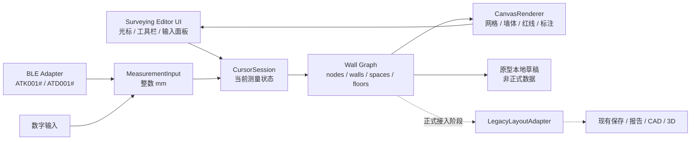

# 新版测绘模块开发蓝图 (Surveying Module)

> 文档状态：`Planned`  
> 基线版本：v0.1，2026-05-26  
> 参考产品：知户型测绘界面介绍视频  
> 本文定位：新版测绘模块的主架构文档与实施约束入口。

## 目标

在不继续扩张旧版 `miniprogram/pages/editor/` 测量状态机的前提下，规划一套独立的知户型式测绘工作台。新版以画布上的光标和墙图为中心：用户先决定墙体连接关系和方向，再用蓝牙测距仪或毫米数字输入确认当前墙段长度。

最终目标覆盖参考视频中可见的完整工作台能力：连续绘墙、墙侧与墙厚、画布控制、保存与恢复、多楼层、2D/3D/漫游、朝向、参照和导出入口。门窗及构件在获得专门参考资料后另行设计。

## 已锁定决策

| 范畴 | 决策 |
| --- | --- |
| 页面边界 | 新版实现位于独立页面 `miniprogram/pages/surveying-editor/`；旧 `editor` 在切换验收前保持可用。 |
| 入口策略 | 正式开放时提供“旧版测量 / 新版测绘体验”双入口，不直接替换旧入口。 |
| 视觉原则 | 复刻界面区域、操作顺序和反馈节奏，使用本产品品牌颜色、图标和文案。 |
| 核心模型 | 新版以墙段/节点/空间/楼层组成的墙图为源数据，不以旧 `rooms/homeOutline/partitions` 作为编辑真相。 |
| 单位 | 墙图所有原始坐标、长度和墙厚统一为整数毫米。 |
| 测量基准 | 红线是实际测距基线；墙厚和墙体位于红线哪一侧必须持久保存并可切换。 |
| 第一原型 | 仅支持一个闭合空间的墙体测量体验，不写正式户型数据，不实现门窗、导出或 3D。 |
| 切换条件 | 新版通过测量准确性、恢复可靠性和下游兼容验收后，才可成为默认入口。 |

## 文档索引

状态值统一使用 `Not Started`、`Planned`、`In Progress`、`Validated`、`Deferred`。

| 文档 | 状态 | 内容 |
| --- | --- | --- |
| [参考视频分析](./reference-interface-video.md) | `Validated` | 视频来源、时间轴、已观察行为与资料缺口。 |
| [界面外壳架构](./architecture-shell.md) | `Planned` | 页面布局、控件职责、手势、组件边界和品牌适配。 |
| [墙图数据架构](./architecture-wall-graph.md) | `Planned` | 毫米坐标模型、测量红线、墙厚、空间闭合与兼容适配。 |
| [测量流程架构](./architecture-measurement-flow.md) | `Planned` | 光标状态机、蓝牙/手输、闭合、复尺和异常恢复。 |
| [路线图与验收](./roadmap-and-acceptance.md) | `Planned` | 按难度和依赖拆分的阶段交付、验收与切换门槛。 |
| [后续功能库存](./future-parity-backlog.md) | `Deferred` | 完整对标功能、门窗等待项和未确认能力。 |

## 总体架构

## Canvas 渲染层重构计划

当前原型曾用多层 `view + CSS rotate` 拼接灰墙、黑线、红线和尺寸标注。该方式适合快速验证交互，但在连续转角、闭合首尾、短边标注和局部重叠场景下容易出现 1px 缝隙、红线变粗、拐角断线和层级遮挡。后续应将几何绘制迁移到 Canvas，DOM 只保留交互控件和可点击浮层。

### 渲染职责划分

| 层级 | 归属 | 内容 | 原则 |
| --- | --- | --- | --- |
| 背景网格 | Canvas | 细网格、主网格、蓝色光标轴线 | 跟随视口平移缩放绘制，不依赖 CSS 背景定位。 |
| 灰色墙体 | Canvas | 按红线、墙侧、视觉墙厚生成的墙体多边形 | 从墙图几何计算 polygon 后统一填充，转角处不得露白。 |
| 黑色墙线 | Canvas | 外轮廓线、开放端帽、闭合后的首尾连接 | 使用同一套转角交点几何绘制 path，不按墙段 DOM 拼接。 |
| 红色测量线 | Canvas | 实际测距基线、预览橙线、转角红线连接 | 以 `startNode -> endNode` 为准，线宽统一，转角连续，不因墙厚裁剪。 |
| 尺寸标注 | Canvas | 尺寸辅助线、箭头、蓝色数值标签 | 每条边独立布局，按边方向和空间内外侧避让。 |
| 闭合辅助线 | Canvas | 橙色闭合虚线、闭合目标提示 | 仅在 `closing` 或接近首点的预览状态绘制。 |
| 操作控件 | DOM | 工具栏、输入键盘、光标拖拽热区、“合”按钮、测量位置按钮 | 保持可点击、可命中、可无障碍调试，不塞进 Canvas。 |

### 数据流

1. `surveyWallGraph` 继续作为唯一测量源数据，保存节点、墙段、空间、楼层、墙厚和测量侧。
2. 新增 `surveyCanvasRenderer` 或同等模块，把墙图和 viewport 转成 Canvas 绘制指令。
3. 页面 `surveying-editor` 只负责状态更新、手势、输入和触发重绘，不再在 WXML 中循环绘制墙体 DOM。
4. Canvas 绘制指令与未来 `normalizedLayout` 适配层共享几何算法，避免 UI、CAD、3D 各自计算一套墙体结果。

### 实施步骤

1. 增加 Canvas 节点和绘制生命周期：在 `onReady` 获取 canvas context，`syncFromDraft` 后统一调度重绘。
2. 先迁移背景网格、灰色墙体、黑色墙线和红色测量线，保留现有 DOM 标注作为过渡。
3. 迁移尺寸标注和闭合辅助线，删除墙体相关 `.wall-render` DOM 层和补丁式 `joinFill/redlineParts` 逻辑。
4. 保留光标、按钮、工具栏、数字键盘、墙体点击热区等 DOM 交互；需要命中墙体时从墙图几何做 hit-test。
5. 补充 Canvas 级视觉验收用例，覆盖 L 型、U 型、闭合、短边、缩放和平移。

### 验收标准

- L 型、U 型和闭合首尾交汇处灰墙连续、黑线闭合、红线不断角也不加粗。
- 红线始终表示真实测量基线，墙厚变化不改变红线端点和长度。
- 尺寸标注按每条边绘制，短边和相邻边不互相压住。
- 平移、缩放、撤销、重做、复尺后 Canvas 与墙图数据保持一致。
- 该重构不写正式户型数据，不触碰旧版 `miniprogram/pages/editor/editor.*`。

## 实施边界

### 原型期间允许

- 新建独立测绘页及只服务于新版的组件和墙图工具模块。
- 复用 `miniprogram/utils/bluetooth.js` 的稳定连接与命令能力，并用新版会话状态消费读数。
- 使用独立的本地原型草稿键保存体验过程，便于反复现场验证。

### 原型期间禁止

- 把新版交互继续塞入旧 `editor.js` 的 `guidedEdgeIndex` / `pendingDirection` 流程。
- 将原型墙图写入正式 floor plan、覆盖旧草稿或改变旧版默认入口。
- 在缺少门窗参考流程时，将旧门窗弹层硬接到新版墙图中。
- 将知户型品牌素材、标识或文案直接复制进产品。

## 第一可体验版本

第一版本应提供一条可完成的单空间测墙路径：

1. 从双入口进入新版测绘工作台。
2. 在空白网格上放置光标并拉出待确认墙段。
3. 使用手动毫米输入或已连接测距仪确认直墙/斜墙长度。
4. 切换墙厚及红线对应的墙体侧，持续绘制后续墙段。
5. 靠近起点时完成单空间闭合。
6. 支持选择已有墙复尺、撤销、重做、平移、缩放和重置光标。
7. 退出后仅保留原型本地数据，不更新正式户型记录。

## 与现有测量模块的关系

现有 `AGENTS.md` / `AGENTS.zh-CN.md` 维护的是已完成的旧版测量库存。本目录记录的是新版目标架构，不代表功能已实现。因此：

- 仅新增或调整本目录文档时，不修改旧版完成模块清单。
- 首次新增 `surveying-editor` 源码、入口或复用旧测量基础设施时，必须同步更新根目录双语 `AGENTS` 文档，注明新版模块范围及受影响的既有能力。
- 修改旧 `editor.*`、蓝牙公共实现、正式保存、导出、3D 或测量日志时，仍须按照根目录库存规则说明影响模块。

## 阶段入口

完整交付顺序、风险分级和验收条件见 [路线图与验收](./roadmap-and-acceptance.md)。任何新阶段开始前，先更新该文档中的状态和已验证证据，再实施代码。
