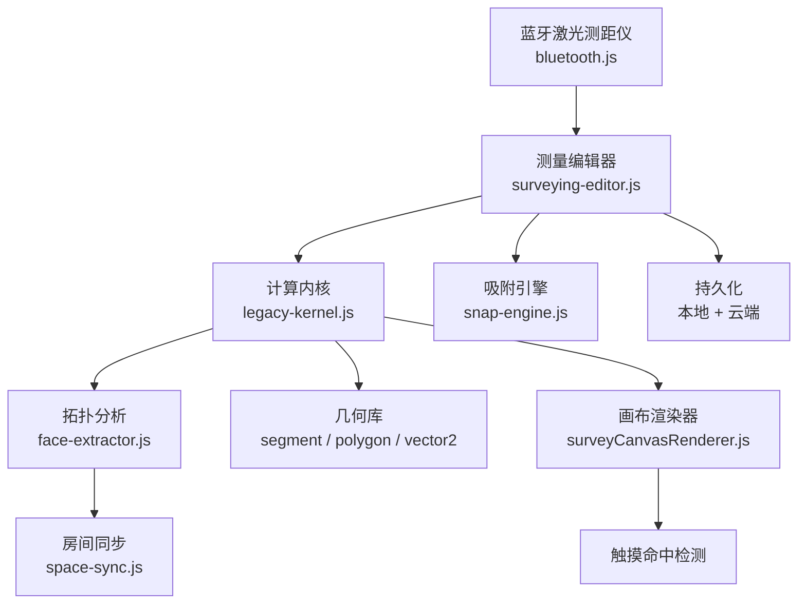

# 小程序测量算法分析报告

> 分析范围：`miniprogram/utils/survey/` 全部模块、`surveyCanvasRenderer.js`、`bluetooth.js`、`surveying-editor.js`

---

## 算法架构总览

### 核心算法清单

| 算法 | 位置 | 用途 |
|------|------|------|
| Shoelace 公式 | `polygon.js` | 有向面积 / 房间面积 |
| Ray-Casting | `legacy-kernel.js` L292-307 | 点是否在多边形内 |
| Tarjan 桥边检测 | `face-extractor.js` L34-88 | 识别悬挂墙（不构成房间） |
| 半边数据结构 | `face-extractor.js` L90-133 | 从墙图提取最小封闭面 |
| 向量投影 / 叉积 | `legacy-kernel.js` L607+ | 垂直距离、法线方向 |
| Miter Joint 计算 | `legacy-kernel.js` L1467-1480 | 墙角接合几何 |
| 滞回吸附 | `snap-engine.js` | 带 acquire/release 阈值的节点吸附 |
| 碰撞回避标注 | `surveyCanvasRenderer.js` L583 | 尺寸标注防重叠 |

---

## 🔴 严重缺陷 (Critical)

### 1. 图的平面性未验证 — 墙体交叉导致拓扑崩溃

> [!CAUTION]
> **影响**: 绘制两面相交但无共享节点的墙时，房间检测完全失效，可能进入死循环。

**位置**: [`face-extractor.js`](file:///G:/workspace/向总/Smart-Floor-Planner/miniprogram/utils/survey/topology/face-extractor.js) L97-101

**问题**: `extractFaces` 严格按 `startNodeId / endNodeId` 拓扑走边。如果两面墙在几何上交叉，但图中没有对应的交叉节点，半边遍历会提取出完全错误的多边形形状，或者无限循环。

**现状**: 当前依赖用户画墙时自动触发 `splitWallAtNodes` 来维护平面性，但以下场景会绕过：
- 通过 BLE 修改已有墙长度（`remeasureSelectedWall`）使其穿过另一面墙
- 云端恢复的数据本身含交叉
- 角度/长度组合使预览墙穿越已有结构

**建议**: 在每次拓扑变更后增加 $O(E^2)$ 的几何交叉检测，或至少在 `extractFaces` 入口检测并报告。

---

### 2. 并发云保存竞态 — 可能创建重复户型记录

> [!CAUTION]
> **影响**: 首次保存的新户型（`serverDraftId` 为空）在自动保存和手动保存同时触发时，两个 `POST /floorplans` 请求都会创建记录。

**位置**: [`surveying-editor.js`](file:///G:/workspace/向总/Smart-Floor-Planner/miniprogram/packages/surveying/editor/surveying-editor.js) L4514-4534

**问题**: `onSaveDraft()` 直接调用 `saveFormalFloorPlan('draft')` 而未检查 `this.cloudSaveInFlight` 锁。当自动保存正在进行、`serverDraftId` 尚未赋值时，手动保存会再发一个 POST。

**建议**: 在 `onSaveDraft` 入口检查 `cloudSaveInFlight`，若正在保存则排队而非重入。

---

### 3. 测量审计日志刷新竞态

> [!WARNING]
> **影响**: `flushPendingMeasurements` 异步发送网络请求时，若另一事件并发修改 `pendingMeasurementRecords` 数组或触发第二次刷新，可能导致审计记录重复发送或丢失。

**位置**: [`surveying-editor.js`](file:///G:/workspace/向总/Smart-Floor-Planner/miniprogram/packages/surveying/editor/surveying-editor.js)

**建议**: 使用 `flushing` 互斥标志，先从数组中 splice 出待发送记录再异步处理。

---

## 🟠 中等缺陷 (Medium)

### 4. 累积整数量化误差

> [!WARNING]
> **影响**: 多段连续测量时，各段 `Math.round()` 的整数 mm 累积误差最高可达 $\pm 0.5\text{mm} \times N$ 段。对于 20 段的复杂户型，理论最大误差 ±10mm。

**位置**: [`legacy-kernel.js`](file:///G:/workspace/向总/Smart-Floor-Planner/miniprogram/utils/survey/legacy-kernel.js) L242

**细节**:
- `distanceMm()` 对欧几里得距离立即 `Math.round()`
- 吸附引擎 `normalizeCandidate` 也对坐标做 `Math.round()`
- 反复进行"投影→取整→再计算距离"操作时误差链式放大

**建议**: 内核保留浮点精度，仅在 UI 展示和最终序列化时取整。

---

### 5. 角度精度截断至 0.1°

**位置**: [`legacy-kernel.js`](file:///G:/workspace/向总/Smart-Floor-Planner/miniprogram/utils/survey/legacy-kernel.js) L265-270

**问题**: `normalizeAngle` 使用 `Math.round(normalized * 10) / 10` 将角度截断到 0.1° 精度。对于长墙（如 8 米），0.1° 偏差在末端产生 $8000 \times \tan(0.1°) \approx 14\text{mm}$ 的位移误差。

**影响**: 正交吸附判定、共线检测在极端情况下会失误。

---

### 6. 凹角（270° 室内角）Miter 缺陷 — 阶梯状瑕疵

**位置**: [`legacy-kernel.js`](file:///G:/workspace/向总/Smart-Floor-Planner/miniprogram/utils/survey/legacy-kernel.js) L1475-1480

**问题**: 当房间内角为凹角（270°）时，miter 交点计算落在两面外墙线的内侧一个墙厚处，算法放弃生成 miter 并返回 `null`，回退到平面重叠逻辑，导致视觉上出现"阶梯状"接缝。

**影响**: L 形、U 形等含凹角的户型墙角渲染不正确，虽不影响面积计算但影响专业感。

---

### 7. 正交吸附过于简单 — 缺少 45° 和自由角度吸附

**位置**: [`legacy-kernel.js`](file:///G:/workspace/向总/Smart-Floor-Planner/miniprogram/utils/survey/legacy-kernel.js) L1612-1630

**问题**: `snapPreviewPoint` 仅比较 `|dx|` 和 `|dy|` 选择水平或垂直对齐，没有：
- 45° 对角线吸附
- 相对于已有墙的平行/垂直吸附
- 自定义角度锁定

**影响**: 非正交户型（如斜墙、梯形房间）操作困难。

---

### 8. 触摸移动时过度 `setData` 导致低端机卡顿

**位置**: [`surveying-editor.js`](file:///G:/workspace/向总/Smart-Floor-Planner/miniprogram/packages/surveying/editor/surveying-editor.js) L4928-4931

**问题**: `onCanvasTouchMove` 中，当 `updateViewportInteraction` 回退到修改 draft 时，每次 touch move 事件都触发 `this.syncFromDraft()` → `setData()`。在 60fps 触摸事件流下，这对低端设备的渲染性能造成严重压力。

**建议**: 使用 `requestAnimationFrame` 节流 `setData`，或在手势进行时仅更新 canvas 层而不触发 WXML 数据同步。

---

## 🟡 轻微缺陷 / 局限 (Low / Limitation)

### 9. 房间同步的 $O(F \times S \times W)$ 复杂度

**位置**: [`space-sync.js`](file:///G:/workspace/向总/Smart-Floor-Planner/miniprogram/utils/survey/topology/space-sync.js) L102-113

**问题**: 新 face 与已有 space 的匹配是三重循环：`faces × spaces × wallsPerFace`。当前户型规模（< 50 房间）无感知，但高度分段的生成型户型可能变慢。

---

### 10. 嵌套孔洞不被自动扣除

**位置**: [`face-extractor.js`](file:///G:/workspace/向总/Smart-Floor-Planner/miniprogram/utils/survey/topology/face-extractor.js)

**问题**: 如果一个大房间内部有独立的墙环（例如柱子围合），内环被提取为独立 face，但不会自动从外部 face 的面积中扣除。面积计算会偏大。

---

### 11. 半边排序的浮点阈值脆弱性

**位置**: [`face-extractor.js`](file:///G:/workspace/向总/Smart-Floor-Planner/miniprogram/utils/survey/topology/face-extractor.js) L119

**问题**: 径向排序使用 `1e-9` 阈值区分角度。对于坐标值极大（如百万 mm 级别的全局坐标系）或极密集的角度，IEEE-754 精度可能不足，导致排序不稳定。

**实际风险**: 低。当前户型尺度下安全。

---

### 12. 零长度墙的防御不完整

**位置**: [`legacy-kernel.js`](file:///G:/workspace/向总/Smart-Floor-Planner/miniprogram/utils/survey/legacy-kernel.js) L612

**问题**: `perpendicularDistanceToLineMm` 在线段长度为 0 时回退到点距离计算（避免 NaN），但零长度墙是拓扑异常，应由 invariants 系统清除。当前清除逻辑未确认是否覆盖所有入口。

---

### 13. Undo 历史使用完整深拷贝

**位置**: [`surveying-editor.js`](file:///G:/workspace/向总/Smart-Floor-Planner/miniprogram/packages/surveying/editor/surveying-editor.js) L4029

**问题**: 每次操作保存 `surveyGraph.cloneDraft(this.draft)` 的完整深拷贝，上限 40 步。对于复杂户型（数百面墙 + 大量 opening），内存占用可达数十 MB。

**建议**: 考虑基于 command/patch 的增量 undo 策略。

---

### 14. 尺寸标注碰撞回避仅支持二级候选

**位置**: [`surveyCanvasRenderer.js`](file:///G:/workspace/向总/Smart-Floor-Planner/miniprogram/utils/surveyCanvasRenderer.js) L152, L583

**问题**: 每个标注仅生成 2 个备选位置（inner/outer × 2 offset band）。在密集墙体区域，所有备选可能都被占用，标注仍然重叠。

---

## ✅ 设计亮点（做得好的地方）

| 亮点 | 说明 |
|------|------|
| **迭代式 DFS** | 针对微信 JS 引擎低调用栈限制，桥边检测使用显式栈 |
| **滞回吸附** | acquire/release 双阈值避免吸附时的抖动 |
| **OffscreenCanvas 缓存** | "合" 闭合按钮只渲染一次到离屏画布，后续用 `drawImage` |
| **交互层轻量渲染** | 手势操作时跳过文字/复杂标注，保持帧率 |
| **放大镜静态快照** | 拖拽时使用 `lensSource` 快照避免递归渲染 |
| **Ray-Casting 边界安全** | 严格不等号处理顶点恰好在射线上的情况 |
| **锐角 Miter 保护** | < 30° 角时拒绝 miter 防止几何爆炸 |
| **BLE 800ms 防抖** | 防止蓝牙快速连续读数造成重复测量 |
| **本地/云冲突解决** | 时间戳对比策略保留较新的草稿 |

---

## 缺陷优先级矩阵

| # | 缺陷 | 严重度 | 发生概率 | 修复难度 | 建议优先级 |
|---|------|--------|----------|----------|-----------|
| 1 | 平面性未验证 | 🔴 严重 | 中 | 中 | **P0** |
| 2 | 并发保存竞态 | 🔴 严重 | 中 | 低 | **P0** |
| 3 | 审计日志竞态 | 🟠 中等 | 低 | 低 | **P1** |
| 4 | 累积量化误差 | 🟠 中等 | 高 | 高 | **P1** |
| 5 | 角度精度 0.1° | 🟠 中等 | 低 | 中 | **P2** |
| 6 | 凹角 Miter 瑕疵 | 🟠 中等 | 中 | 高 | **P2** |
| 7 | 仅正交吸附 | 🟡 低 | 中 | 中 | **P2** |
| 8 | touchMove 过度 setData | 🟠 中等 | 中 | 低 | **P1** |
| 9 | 房间同步复杂度 | 🟡 低 | 低 | 中 | **P3** |
| 10 | 嵌套孔洞不扣除 | 🟡 低 | 低 | 中 | **P3** |
| 11 | 半边排序阈值 | 🟡 低 | 极低 | 低 | **P3** |
| 12 | 零长度墙防御 | 🟡 低 | 低 | 低 | **P3** |
| 13 | Undo 深拷贝内存 | 🟡 低 | 低 | 高 | **P3** |
| 14 | 标注碰撞仅二级 | 🟡 低 | 中 | 中 | **P3** |
