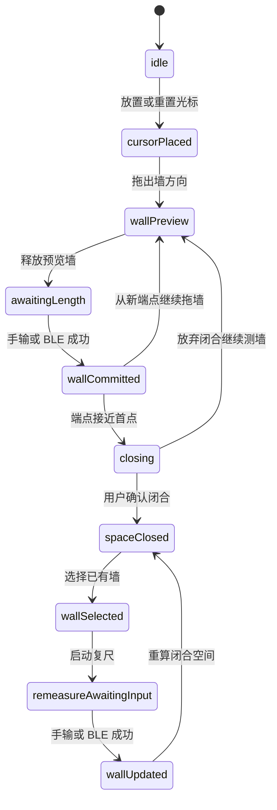

# 测量流程架构

> 状态：`Planned`  
> 目标：让光标、墙段和输入来源构成不中断的连续测绘流程。

## 主状态机

## 状态职责

| 状态 | 可见反馈 | 接受动作 |
| --- | --- | --- |
| `idle` | 空画布或已有结果；无活动红线。 | 放置光标、导航画布、恢复原型草稿。 |
| `cursorPlaced` | 光标定位在起点。 | 拖出第一墙、重置、切换直/斜线及墙厚。 |
| `wallPreview` | 半透明墙体和红线预览。 | 调整方向与端点，释放后等待长度。 |
| `awaitingLength` | 当前测量位置提示、尺寸待输入、输入/BLE 可用。 | 手输毫米、触发 BLE、切墙侧/墙厚、取消当前墙。 |
| `wallCommitted` | 已确认墙显示稳定尺寸，光标在新端点。 | 继续下一墙、撤销或进入闭合。 |
| `closing` | 起点吸附和“闭合空间”确认反馈。 | 确认闭合或继续绘制。 |
| `spaceClosed` | 单空间填充和面积预览。 | 选墙复尺、查看或重置原型。 |
| `wallSelected` | 选中墙高亮及墙操作浮层。 | 复尺、切测量侧、改墙厚、退出选择。 |
| `remeasureAwaitingInput` | 选中墙成为唯一读数目标。 | 手输/BLE 更新或取消。 |

## 直线与斜线

### 直线模式

- 光标从锚点拖出后，方向吸附至水平或垂直主轴。
- 用户可先决定朝向，确认长度后终点严格按输入毫米沿吸附方向生成。
- 不使用旧版的 `E/S/W/N` 方向弹窗；方向来自画布预览。

### 斜线模式

- 光标拖动提供初始角度，长度输入确认后沿该角度生成终点。
- 画布显示该墙长度和相对上一墙的夹角。
- 第一原型不引入三边法校角；若现场证明需要精密校角，在后续阶段追加校准子流程。

## 长度输入

| 输入来源 | 行为 |
| --- | --- |
| 手动数字输入 | 打开数字面板，单位固定显示 `mm`；合法整数确认后提交当前墙或当前复尺墙。 |
| BLE 测距 | 页面通过输入适配器接收米值并换算为整数毫米；只有存在明确输入目标时才落图。 |

输入优先级与互斥规则：

1. 同一时刻只允许一个 `pendingWallId` 或一个复尺 `selectedWallId` 接收数据。
2. 手动输入面板打开期间，BLE 仍可替代当前未提交值，但首次有效提交即关闭本次等待。
3. 已提交后抵达的重复 BLE 读数不得自动创建下一墙。
4. 未进入等待输入状态时接收到读数，应提示“请先绘制待测墙体”，不改变墙图。

## BLE 适配策略

新版初期复用现有公共设备能力，页面通过适配层绑定当前会话，而不是修改旧编辑器流程：

| 能力 | 规则 |
| --- | --- |
| 连接 | 使用已存在的记忆设备搜索/连接机制，页面展示连接状态和重连入口。 |
| 触发 | 需要测距时发送 `ATK001#`，读取前清除旧缓冲。 |
| 超时 | 超时后用 `ATD001#` 查询；最终无结果则保持待测墙并提示重试。 |
| 重复读数 | 对短间隔相同读数去重，且以当前输入目标 token 防止过期结果落到新墙。 |
| 断线 | 退出 BLE 等待但保留墙预览；用户可切换手输或重连继续。 |

## 墙厚与测量侧

- 默认墙厚来自草稿设置，第一原型初始值为 `200 mm`。
- 当前待确认墙和已选中墙均可修改墙厚。
- 墙侧切换不改变红线长度和端点，只改变墙实体偏移侧及闭合空间推导。
- 连续测绘时，新墙继承最近使用的墙厚和测量侧，用户可随时覆盖。

## 闭合流程

1. 至少存在三面已确认墙后才计算闭合候选。
2. 下一墙终点在首节点 `200 mm` 容差内时，画布提示可闭合。
3. 用户确认后终点吸附首节点，创建一个 `SpaceBoundary` 并结束连续测墙会话。
4. 未达到容差或用户取消时，墙链保持开放，可继续增加墙段。

## 复尺流程

- 闭合空间或开放墙链中均可选中一面已确认墙；第一原型优先保证闭合后复尺正确。
- 点击“复尺”后，该墙成为唯一测量输入目标。
- 新长度保持墙起点和方向不变，移动终点；闭合空间随后重算，若产生无法维持的闭合误差，应提示用户补测相邻墙或撤销。
- 修改墙厚和墙侧不算长度复尺，不覆盖原输入来源。

## 历史与临时草稿

- 每次墙提交、闭合、复尺、墙厚/墙侧确认作为独立撤销快照。
- 平移缩放不写入几何历史，可单独保存在会话视口中。
- Phase 2 默认只保存在内存；Phase 3 可以使用专用键 `surveying_prototype_draft_v1` 保存本地体验草稿。
- 原型草稿不得提交到现有 floor plan API，也不得覆盖旧 `editor` 草稿。

## 失败恢复

| 情形 | 结果 |
| --- | --- |
| 输入为空、非整数或小于最小墙长 | 拒绝提交，保留当前墙预览。 |
| BLE 超时或错误 | 保留待确认墙，允许重试或切换手输。 |
| BLE 断线 | 保留几何与历史，仅清除连接等待状态。 |
| 重置光标 | 清除未提交墙；已确认墙必须通过撤销或明确重置草稿操作删除。 |
| 页面退出 | 提示原型数据不进入正式户型；若启用本地草稿则允许恢复。 |
