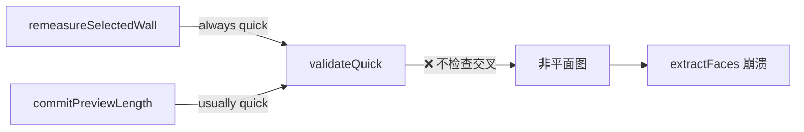

# 小程序测量算法缺陷修复方案

> 按优先级 P0 → P3 排列，每个缺陷含根因、修复策略、代码示例和验证方法

---

## P0-1 · 图平面性未验证 — 墙体交叉导致拓扑崩溃

### 根因分析

[`wall-operations.js`](file:///G:/workspace/向总/Smart-Floor-Planner/miniprogram/utils/survey/operations/wall-operations.js) L5-11 中，`commitPreviewLength` 仅在 `session.fullValidationAfterClosedSplit` 为 true 时才触发 `validateFull`，而 `remeasureSelectedWall`（L16）则始终使用 `quick` 模式。

`validateFull`（[`floor-plan-validator.js`](file:///G:/workspace/向总/Smart-Floor-Planner/miniprogram/utils/survey/invariants/floor-plan-validator.js) L129-144）是**唯一**检测 `UNSPLIT_WALL_INTERSECTION` 的地方，但它在关键变更路径上被跳过了。



### 修复策略：变更后增量交叉检测

不在每次操作后运行 $O(E^2)$ 的全量检测，而是**仅对变更的墙**做增量检测 + 自动分割。

#### [MODIFY] [`wall-operations.js`](file:///G:/workspace/向总/Smart-Floor-Planner/miniprogram/utils/survey/operations/wall-operations.js)

在 `remeasureSelectedWall` 和 `commitPreviewLength` 的 post-operation hook 中增加增量交叉检测：

```javascript
// 新增：增量交叉检测（仅检查受影响的墙）
function detectAndSplitIntersections(floor, changedWallIds) {
  const walls = floor.walls || [];
  const splits = []; // { wallId, otherWallId, intersectionPoint }

  for (const changedId of changedWallIds) {
    const changed = walls.find(w => w.id === changedId);
    if (!changed) continue;
    const cStart = getNode(floor, changed.startNodeId);
    const cEnd = getNode(floor, changed.endNodeId);

    for (const other of walls) {
      if (other.id === changedId) continue;
      // 跳过共享节点的相邻墙
      if (other.startNodeId === changed.startNodeId ||
          other.startNodeId === changed.endNodeId ||
          other.endNodeId === changed.startNodeId ||
          other.endNodeId === changed.endNodeId) continue;

      const oStart = getNode(floor, other.startNodeId);
      const oEnd = getNode(floor, other.endNodeId);

      if (segment.properIntersection(cStart, cEnd, oStart, oEnd)) {
        const pt = segment.intersectionPoint(cStart, cEnd, oStart, oEnd);
        if (pt) splits.push({ wallId: changedId, otherWallId: other.id, point: pt });
      }
    }
  }

  // 对每个交叉点，创建新节点并分割两面墙
  for (const split of splits) {
    const nodeId = createNodeAtPoint(floor, split.point);
    splitWallAtNodes(floor, split.wallId, [nodeId]);
    splitWallAtNodes(floor, split.otherWallId, [nodeId]);
  }

  return splits.length > 0;
}
```

#### [MODIFY] [`segment.js`](file:///G:/workspace/向总/Smart-Floor-Planner/miniprogram/utils/survey/geometry/segment.js)

新增 `intersectionPoint` 函数，计算两线段的精确交点坐标：

```javascript
function intersectionPoint(a1, a2, b1, b2) {
  const d1x = a2.xMm - a1.xMm, d1y = a2.yMm - a1.yMm;
  const d2x = b2.xMm - b1.xMm, d2y = b2.yMm - b1.yMm;
  const denom = d1x * d2y - d1y * d2x;
  if (Math.abs(denom) < 1e-10) return null; // 平行

  const t = ((b1.xMm - a1.xMm) * d2y - (b1.yMm - a1.yMm) * d2x) / denom;
  return {
    xMm: Math.round(a1.xMm + t * d1x),
    yMm: Math.round(a1.yMm + t * d1y)
  };
}
```

#### [MODIFY] [`wall-operations.js`](file:///G:/workspace/向总/Smart-Floor-Planner/miniprogram/utils/survey/operations/wall-operations.js)

在 `wrapOperation` 回调中注入交叉检测：

```diff
 remeasureSelectedWall: wrapOperation('remeasureSelectedWall',
   kernel.remeasureSelectedWall,
-  () => ({ mode: 'quick' })
+  (draft, _args, result) => {
+    const floor = kernel.getActiveFloor(draft);
+    const changedIds = result && result.changedWallIds ? result.changedWallIds : [];
+    if (changedIds.length) {
+      detectAndSplitIntersections(floor, changedIds);
+    }
+    return { mode: 'quick' };
+  }
 ),
```

### 验证方法

1. 单元测试：构造两面十字交叉墙 → 调用 `remeasureSelectedWall` 使其交叉 → 断言自动分割为 4 段
2. 手动测试：在编辑器中画一面长墙，再画一面短墙，用 BLE 修改长墙长度使其穿过短墙 → 确认自动分割

---

## P0-2 · 并发云保存竞态 — 重复户型记录

### 根因分析

[`surveying-editor.js`](file:///G:/workspace/向总/Smart-Floor-Planner/miniprogram/packages/surveying/editor/surveying-editor.js) 中：

| 方法 | 行号 | 检查 `cloudSaveInFlight`? |
|------|------|:---:|
| `autosaveFormalFloorPlan` | L930-953 | ✅ 设置并检查 |
| `onSaveDraft` | L4514-4556 | ❌ 直接调用 `saveFormalFloorPlan` |
| `onSubmitFloorPlan` | L4558-4575 | ❌ 直接调用 `saveFormalFloorPlan` |

竞态时序：
```
autosave → POST /floorplans (in-flight, serverDraftId=空)
          ↓ 用户点击保存
onSaveDraft → POST /floorplans (第二个POST!)
          ↓ 第一个POST返回 → serverDraftId=id1, flush audits to id1
          ↓ 第二个POST返回 → serverDraftId=id2, audits已被清空
结果: id1有审计但被孤立, id2是活跃记录但无审计
```

### 修复策略：Promise 互斥 + 排队

将 `cloudSaveInFlight` 从布尔标志升级为 Promise 互斥锁：

#### [MODIFY] [`surveying-editor.js`](file:///G:/workspace/向总/Smart-Floor-Planner/miniprogram/packages/surveying/editor/surveying-editor.js)

```javascript
// ─── 1. 新增：save 互斥锁 ───
// 在 data/lifetimes 初始化区域
this._savePromise = null;  // 当前正在进行的保存 Promise

// ─── 2. 包装 saveFormalFloorPlan 为互斥调用 ───
async _enqueueCloudSave(status) {
  // 如果有正在进行的保存，先等它完成
  if (this._savePromise) {
    try {
      await this._savePromise;
    } catch (_) {
      // 前一次保存失败不阻止新的保存
    }
  }

  // 前一次保存已完成，serverDraftId 已更新，现在可以安全保存
  const promise = this.saveFormalFloorPlan(status);
  this._savePromise = promise;

  try {
    const result = await promise;
    return result;
  } finally {
    // 仅清除自己的 promise（防止清除后续排队的）
    if (this._savePromise === promise) {
      this._savePromise = null;
    }
  }
}

// ─── 3. 修改 autosaveFormalFloorPlan ───
async autosaveFormalFloorPlan() {
  if (this._savePromise || this.formalCloudLoadInFlight) return false;
  // ... 其余 shouldAutosaveSurveyDraft 检查不变 ...

  try {
    const status = this.data.floorPlanStatus === 'completed' ? 'completed' : 'draft';
    await this._enqueueCloudSave(status);
    return true;
  } catch (err) {
    console.warn('[surveying-editor] Silent autosave failed', err);
    return false;
  }
}

// ─── 4. 修改 onSaveDraft ───
async onSaveDraft() {
  wx.showLoading({ title: '保存草稿...' });
  // ... 本地持久化不变 ...
  try {
    await this._enqueueCloudSave('draft');  // 替代直接调用
    // ... 成功处理不变 ...
  } catch (err) {
    // ... 失败处理不变 ...
  }
}

// ─── 5. 修改 onSubmitFloorPlan ───
async onSubmitFloorPlan() {
  // ... 同理替换为 this._enqueueCloudSave('completed') ...
}
```

### 验证方法

1. 在 `saveFormalFloorPlan` 入口加 500ms `await sleep()` 模拟慢网络
2. 触发自动保存后立即点击手动保存 → 断言只创建 1 个户型记录
3. 检查 `serverDraftId` 只被赋值一次

---

## P1-3 · 测量审计日志刷新竞态

### 根因分析

[`flushPendingMeasurements`](file:///G:/workspace/向总/Smart-Floor-Planner/miniprogram/packages/surveying/editor/surveying-editor.js) L4710-4725 先将 `this.pendingMeasurementRecords = []` 清空，然后逐条异步发送。如果发送期间有新的 BLE 读数加入，或者 P0-2 的竞态导致两次 flush，记录会丢失。

### 修复策略

```diff
  async flushPendingMeasurements(floorPlanId) {
-   const pending = this.pendingMeasurementRecords || [];
-   if (!floorPlanId || !pending.length) return;
-   this.pendingMeasurementRecords = [];
+   if (!floorPlanId) return;
+   if (this._flushingMeasurements) return; // 防重入
+   this._flushingMeasurements = true;
+
+   try {
+     // 原子性地取出当前队列
+     const pending = this.pendingMeasurementRecords || [];
+     if (!pending.length) return;
+     this.pendingMeasurementRecords = [];

    const failed = [];
    for (const record of pending) {
      try {
        await this.sendMeasurementRecord(floorPlanId, record);
      } catch (err) {
        failed.push(record);
-       console.warn('[surveying-editor] Deferred measurement audit logging failed', err);
+       console.warn('[surveying-editor] Deferred audit failed', err);
      }
    }
-   failed.forEach((record) => this.enqueuePendingMeasurement(record));
+   // 将失败记录放回队列头部（保序）
+   if (failed.length) {
+     this.pendingMeasurementRecords = failed.concat(this.pendingMeasurementRecords);
+   }
+   } finally {
+     this._flushingMeasurements = false;
+   }
  }
```

### 验证方法

- 模拟网络延迟，在 flush 进行期间触发 BLE 读数 → 新记录不丢失
- 连续触发两次 flush → 第二次被 `_flushingMeasurements` 拦截

---

## P1-4 · 累积整数量化误差

### 根因分析

[`legacy-kernel.js`](file:///G:/workspace/向总/Smart-Floor-Planner/miniprogram/utils/survey/legacy-kernel.js) L241-243 的 `distanceMm` 和 [`snap-engine.js`](file:///G:/workspace/向总/Smart-Floor-Planner/miniprogram/utils/survey/snap/snap-engine.js) L8-9 的 `normalizeCandidate` 都在中间计算环节做 `Math.round()`。

误差链：`节点坐标取整` → `距离取整` → `投影取整` → `再算距离` → 每步 ±0.5mm 累积

### 修复策略：分离内部精度与展示精度

> [!IMPORTANT]
> 这是影响面最广的修改，建议分阶段推进。

**阶段 1：消除热路径上的中间取整**

```diff
 // legacy-kernel.js
 function distanceMm(a, b) {
-  return Math.round(vector2.distance(a, b));
+  return vector2.distance(a, b); // 保留浮点精度
 }

+// 新增：仅在需要展示/序列化时使用
+function displayMm(value) {
+  return Math.round(value);
+}
```

```diff
 // snap-engine.js - normalizeCandidate
 function normalizeCandidate(candidate) {
   if (!candidate || !candidate.pointMm) return candidate;
-  return Object.assign({}, candidate, {
-    pointMm: {
-      xMm: Math.round(Number(candidate.pointMm.xMm)),
-      yMm: Math.round(Number(candidate.pointMm.yMm))
-    }
-  });
+  return Object.assign({}, candidate, {
+    pointMm: {
+      xMm: Number(candidate.pointMm.xMm),
+      yMm: Number(candidate.pointMm.yMm)
+    }
+  });
 }
```

**阶段 2：在序列化出口统一取整**

在 `buildFormalCloudLayoutData` 和 `persistFormalDraft` 调用链中，仅在最终输出时对坐标和长度做 `Math.round()`。

**阶段 3：渲染层适配**

`surveyCanvasRenderer.js` 中的坐标投影已经经过 `scale` 缩放，浮点 mm 值不会影响像素渲染。仅在标注文字的 `formatMm()` 中取整展示即可。

### 风险评估

> [!WARNING]
> 此修改会改变所有坐标的内部表示从整数变为浮点。需要检查：
> - 序列化/反序列化（JSON 中 `1000` vs `1000.0` 均为合法 Number）
> - 相等性比较（`===` 比较需改为 epsilon 比较）
> - 服务端验证逻辑

### 验证方法

- 构造 20 段 L 形链 → 比较新旧算法的最终闭合误差
- 回归测试：加载已有户型 → 所有房间面积差异 < 1mm²

---

## P1-8 · touchMove 过度 setData 导致卡顿

### 根因分析

[`surveying-editor.js`](file:///G:/workspace/向总/Smart-Floor-Planner/miniprogram/packages/surveying/editor/surveying-editor.js) L4928-4931 和 L5023-5026，当 `updateViewportInteraction` 返回 false 时：

```javascript
if (!this.updateViewportInteraction(nextViewport)) {
  this.draft = surveyGraph.updateViewport(this.draft, nextViewport);
  this.syncFromDraft();  // 每次 touchmove 都触发 setData!
}
```

在 60fps 触摸事件流下，`syncFromDraft()` → `setData()` 会严重阻塞渲染线程。

### 修复策略：RAF 节流

```javascript
// 新增节流工具
_throttledSyncFromDraft() {
  if (this._syncRAFPending) return;
  this._syncRAFPending = true;

  // 微信小程序没有 requestAnimationFrame，用 16ms setTimeout 模拟
  setTimeout(() => {
    this._syncRAFPending = false;
    this.syncFromDraft();
  }, 16);
}
```

修改 touchMove 中的回退路径：

```diff
  // pinch 模式 (L4928-4931)
  if (!this.updateViewportInteraction(nextViewport)) {
    this.draft = surveyGraph.updateViewport(this.draft, nextViewport);
-   this.syncFromDraft();
+   this._throttledSyncFromDraft();
  }

  // pan 模式 (L5023-5026)
  if (!this.updateViewportInteraction(nextViewport)) {
    this.draft = surveyGraph.updateViewport(this.draft, nextViewport);
-   this.syncFromDraft();
+   this._throttledSyncFromDraft();
  }
```

### 验证方法

- 在低端机（如 iPhone 8）上快速拖拽/缩放 → 对比修复前后帧率
- 通过 `console.time` 统计 `setData` 调用频率：修复前 60次/秒 → 修复后 ≤ 60次/秒

---

## P2-5 · 角度精度截断至 0.1°

### 修复策略

```diff
 // legacy-kernel.js
 function normalizeAngle(angle) {
   let normalized = angle;
   while (normalized <= -180) normalized += 360;
   while (normalized > 180) normalized -= 360;
-  return Math.round(normalized * 10) / 10;
+  return normalized; // 保留完整浮点精度
 }

+// 新增：仅用于 UI 展示
+function displayAngle(angle) {
+  return Math.round(normalizeAngle(angle) * 10) / 10;
+}
```

需同步检查所有调用 `normalizeAngle` 的位置，确保比较逻辑使用 epsilon 而非 `===`。

---

## P2-6 · 凹角（270°）Miter 缺陷 — 阶梯状接缝

### 根因分析

[`legacy-kernel.js`](file:///G:/workspace/向总/Smart-Floor-Planner/miniprogram/utils/survey/legacy-kernel.js) L1467-1480，当 `isInteriorJoinProjection` 判定 miter 点落在两面墙内部时返回 `null`，回退到平面重叠。

### 修复策略：凹角切角（Chamfer）处理

对于凹角，不生成 miter 尖端，而是生成一个**切角**（chamfer），用两个切点替代一个尖角：

```javascript
function offsetJoinPoint(current, adjacent) {
  // ... 现有 miter 计算 ...
  const point = computeMiterIntersection(current, adjacent);

  if (isInteriorJoinProjection(current, point) &&
      isInteriorJoinProjection(adjacent, point)) {
    // 凹角：生成 chamfer 而非返回 null
    return {
      type: 'chamfer',
      points: [
        clampToOuterEnd(current),   // 当前墙外线末端
        clampToOuterStart(adjacent) // 相邻墙外线起点
      ]
    };
  }
  return { type: 'miter', points: [point] };
}
```

渲染侧（`surveyCanvasRenderer.js` `buildWallScene`）需要适配 chamfer 类型，用两个顶点替代一个尖角顶点来构建 `bodyPolygon`。

### 影响范围

- 仅影响视觉渲染，不影响面积计算（面积基于中心线拓扑）
- L 形、U 形、Z 形户型的墙角接缝质量提升

---

## P2-7 · 正交吸附过于简单

### 修复策略：多角度吸附候选系统

```javascript
function snapPreviewPoint(anchor, rawPoint, mode) {
  const point = { xMm: rawPoint.xMm, yMm: rawPoint.yMm };

  if (mode !== 'straight') return point;

  const dx = point.xMm - anchor.xMm;
  const dy = point.yMm - anchor.yMm;
  const rawAngle = Math.atan2(dy, dx) * 180 / Math.PI;
  const dist = Math.sqrt(dx * dx + dy * dy);

  // 候选吸附角度：0°, 45°, 90°, 135°, 180°, -45°, -90°, -135°
  const snapAngles = [0, 45, 90, 135, 180, -45, -90, -135];
  const SNAP_THRESHOLD_DEG = 8; // 吸附阈值

  let bestAngle = null;
  let bestDiff = SNAP_THRESHOLD_DEG;

  for (const target of snapAngles) {
    const diff = Math.abs(normalizeAngle(rawAngle - target));
    if (diff < bestDiff) {
      bestDiff = diff;
      bestAngle = target;
    }
  }

  if (bestAngle !== null) {
    const rad = bestAngle * Math.PI / 180;
    return {
      xMm: anchor.xMm + Math.round(dist * Math.cos(rad)),
      yMm: anchor.yMm + Math.round(dist * Math.sin(rad))
    };
  }

  return point; // 无吸附
}
```

> [!NOTE]
> 可通过配置参数控制是否启用 45° 吸附（`enableDiagonalSnap`），默认关闭以保持现有行为向后兼容。

---

## P3 · 低优先级缺陷修复方案

### P3-9 · 房间同步复杂度

**策略**: 为每个 face 构建 wallId Set，匹配时用 Set 交集替代嵌套循环。将 $O(F \times S \times W)$ 降为 $O(F \times S)$。

### P3-10 · 嵌套孔洞不扣除

**策略**: 在 `extractFaces` 后增加后处理，用 `isPointInsidePolygon` 检查每个 face 的质心是否在另一个 face 内部。若是，标记为 `hole` 并从外部 face 面积中扣除。

### P3-11 · 半边排序阈值

**策略**: 将 `1e-9` 提升为 `1e-6`，并增加对排序稳定性的文档说明。当前实际风险极低。

### P3-12 · 零长度墙防御

**策略**: 在 `validateQuick` 中已有零长度墙检测（validator L67-70），确保 `commitPreviewLength` 和 `remeasureSelectedWall` 在操作完成后清除零长度墙。

### P3-13 · Undo 深拷贝内存

**策略（长期）**: 引入 structural sharing（类似 Immer）或 command-based undo。**短期**：将 `MAX_HISTORY` 从 40 降至 20，并在内存压力时主动 trim 旧记录。

### P3-14 · 标注碰撞仅二级

**策略**: 增加第三级候选位置（对面延伸线外侧），并在所有候选都冲突时缩小字号或省略非关键标注。

---

## 修复优先级与工作量评估

| 优先级 | 缺陷 | 预估工时 | 风险 | 建议阶段 |
|--------|------|----------|------|----------|
| **P0-1** | 平面性验证 | 2-3天 | 中（需充分测试拓扑变更） | Sprint 1 |
| **P0-2** | 并发保存竞态 | 0.5天 | 低 | Sprint 1 |
| **P1-3** | 审计日志竞态 | 0.5天 | 低 | Sprint 1 |
| **P1-4** | 累积量化误差 | 3-5天 | 高（影响面广） | Sprint 2 |
| **P1-8** | touchMove 性能 | 0.5天 | 低 | Sprint 1 |
| **P2-5** | 角度精度 | 1天 | 中（需配合 P1-4） | Sprint 2 |
| **P2-6** | 凹角 Miter | 2天 | 中 | Sprint 2 |
| **P2-7** | 多角度吸附 | 1天 | 低 | Sprint 2 |
| **P3-*** | 6项低优先级 | 各0.5-1天 | 低 | Sprint 3 |

### 建议的 Sprint 安排

**Sprint 1（紧急修复，约 4 天）**:
- P0-2 并发保存竞态 ← 最简单的 P0，先修
- P1-3 审计日志竞态
- P1-8 touchMove 性能
- P0-1 平面性验证

**Sprint 2（精度与视觉提升，约 7 天）**:
- P1-4 累积量化误差（需大量回归测试）
- P2-5 角度精度（配合 P1-4 一起做）
- P2-6 凹角 Miter
- P2-7 多角度吸附

**Sprint 3（质量打磨）**:
- 6 项 P3 缺陷
