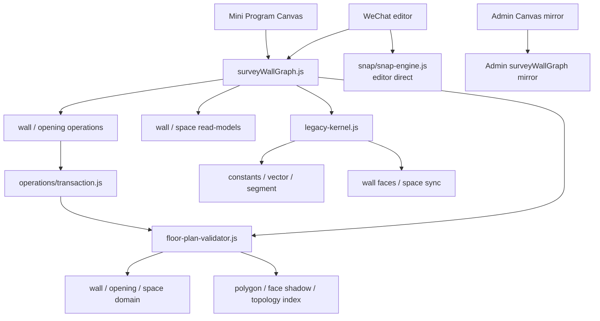

# `legacy-kernel.js` Phase 0 可复现基线

> 状态：已完成  
> 建立日期：2026-09-03  
> 适用范围：小程序正式量房墙图内核、调用方与 Admin 只读运行镜像

本文固化治理计划 Phase 0 的当前事实。机器可读的完整结果以
[`expected-audit.json`](../../miniprogram/test/fixtures/survey-kernel-baseline/expected-audit.json)、
[`expected-behavior.json`](../../miniprogram/test/fixtures/survey-kernel-baseline/expected-behavior.json) 和
[`performance-baseline.json`](../../miniprogram/test/fixtures/survey-kernel-baseline/performance-baseline.json)
为准。它们记录“迁移前的可观测行为”，不把旧行为自动宣告为新的业务规范。

## 1. 范围与不变项

Phase 0 只增加审计、fixture、行为快照、性能快照和测试命令，并将 H5 测试中
滞后的 renderer revision 期望从 v17 对齐到当前生产 v20；未修改生产 kernel、façade、
editor、Canvas、BLE、Admin 适配器或数据库逻辑。因此以下对外合同不变：

- 唯一正式量房入口不变；
- version-4 `surveyGraph` 持久化外壳和毫米单位不变；
- 路由、API、权限、UI、BLE 与测量审计行为不变；
- Admin 仍使用当前可校验的运行镜像。

## 2. façade 导出与覆盖关系

审计时 `legacy-kernel.js` 为 7,239 行、245 个顶层函数和 64 个 CommonJS 导出。
`surveyWallGraph.js` 最终对外提供 69 个导出，按以下顺序合并：

```text
legacy-kernel
  -> wall-geometry-read-model
  -> space-boundary-read-model
  -> space-dimension-read-model
  -> transactional-wall-operations
  -> transactional-opening-operations
  -> floor-plan-validator
```

同名时后者胜出。实际导出来源如下：

| 实际来源 | 数量 | 导出 |
| --- | ---: | --- |
| `survey/legacy-kernel.js` | 47 | `CLOSE_TOLERANCE_MM`, `DEFAULT_SCALE`, `DEFAULT_THICKNESS_MM`, `MIN_THICKNESS_MM`, `MIN_WALL_LENGTH_MM`, `VERTEX_AXIS_SNAP_TOLERANCE_MM`, `angleDeg`, `applyPreviewInteriorAngle`, `canSetInitialMeasurementSide`, `cancelPending`, `clearBleLockedBearing`, `cloneDraft`, `createSurveyDraft`, `distanceMm`, `getActiveFloor`, `getClosurePath`, `getCursorDisplayPoint`, `getCursorPlacementTarget`, `getMinimumActiveCloseWallCount`, `getMinimumClosureSuggestionWallCount`, `getMinimumDirectBoundaryCloseWallCount`, `getNode`, `getOpening`, `getWall`, `getWallSnapPoint`, `holdPreviewForInput`, `isDirectClosureHit`, `lockPreviewBearing`, `materializeLockedPreview`, `placeCursor`, `placeNewWallChainCursor`, `renameClosedSpace`, `reopenLastDiagonalWallForAngle`, `repairCollinearDegree2Walls`, `resetCursor`, `selectOpening`, `selectSpace`, `selectWall`, `setFixedNode`, `setMeasurementSide`, `setMode`, `setThickness`, `startPreview`, `startPreviewFromBearing`, `startRemeasure`, `startWallSnap`, `updateViewport` |
| `read-model/wall-geometry.js` | 7 | `buildWallJoinRenderGeometries`, `buildWallRenderGeometry`, `buildWallSnapGeometry`, `measuredReadingMm`, `projectWallFaces`, `projectWorkingFace`, `resolveBodyNormal` |
| `read-model/space-boundary.js` | 3 | `buildSpaceBoundaryPoints`, `buildSpaceInnerBoundaryPoints`, `buildSpaceRenderBoundaryPoints` |
| `read-model/space-dimensions.js` | 2 | `buildSpaceDimensionPlan`, `calculateSpaceAreaMm2` |
| `operations/wall-operations.js` | 6 | `commitPreviewLength`, `confirmClosure`, `deleteClosedSpace`, `deleteWall`, `remeasureSelectedWall`, `snapCursorToWall` |
| `operations/opening-operations.js` | 3 | `addOpeningToWall`, `deleteOpening`, `updateOpening` |
| `invariants/floor-plan-validator.js` | 1 | `validateSurveyDraft` |

64 个 legacy 导出中有 17 个被后续层覆盖：
`addOpeningToWall`, `buildSpaceBoundaryPoints`, `buildSpaceDimensionPlan`,
`buildSpaceInnerBoundaryPoints`, `buildSpaceRenderBoundaryPoints`,
`buildWallJoinRenderGeometries`, `buildWallRenderGeometry`, `buildWallSnapGeometry`,
`calculateSpaceAreaMm2`, `commitPreviewLength`, `confirmClosure`, `deleteClosedSpace`,
`deleteOpening`, `deleteWall`, `remeasureSelectedWall`, `snapCursorToWall`, `updateOpening`。

其中 8 个由 read-model 接管，9 个由事务 operation 接管；
`wall-geometry.js` 另增 4 个新名称，validator 另增 1 个新名称。测试不仅比较名称，
还校验 façade 值确实来自记录的最后胜出层。

## 3. 调用方与当前依赖图

审计扫描 `miniprogram/`、`admin/src/`、`admin/scripts/`、`surveying-h5/` 和仓库
`scripts/` 下的 JS/TS 源码。发现 40 个 façade 消费者：

| 分类 | 数量 | 关键边界 |
| --- | ---: | --- |
| 小程序生产可达 | 1 | `packages/surveying/utils/surveyCanvasRenderer.js` |
| editor 直连 | 1 | `packages/surveying/editor/surveying-editor.js` |
| Admin 生产 | 1 | `admin/src/lib/survey-runtime/surveyCanvasRenderer.js` |
| H5 开发验证台 | 2 | `surveying-h5/src/main.js`, `surveying-h5/src/scenarios.js` |
| 测试专用 | 26 | 正式测试与 fixture/helper；完整文件和导出使用见机器清单 |
| 基线脚本 | 2 | 依赖审计和性能基线 |
| 疑似死调用方 | 7 | 2 个 `miniprogram/tmp-*` 和 5 个已使用旧路径的 H5 脚本 |

另有 29 个源码位置直接提及或 `require` `legacy-kernel`：4 个为生产镜像/
façade/同步或审计脚本，1 个为边界测试，24 个为仍指向已移动旧路径的
H5 独立脚本。后两类只标注为疑似死代码，Phase 0 不删除、不重定向，防止在未确认用途前改变开发工作流。

内核目录共有 27 个审计节点和 39 条静态 CommonJS 边：21 个由 façade 生产可达，
1 个 façade 根节点，1 个 editor 直连节点，0 个仅测试直连节点，4 个疑似死节点。



editor 直连节点是 `survey/snap/snap-engine.js`。四个疑似死内部模块是：

- `survey/core/draft.js`；
- `survey/geometry/intersection.js`；
- `survey/topology/space-topology.js`；
- `survey/topology/wall-split.js`。

完整调用方路径、每个调用方使用的 façade 导出、未解析旧路径、模块节点和 39 条边均保存在
`expected-audit.json`。当源码增删调用或更改导出胜出层时，审计命令会失败。

Admin 镜像审计覆盖 30 对文件：29 对必须字节相同，
`surveyCanvasRenderer.js` 允许仅存在已批准的 Admin `require` 路径重写。建立基线时 30 对全部匹配。

## 4. 代表性 graph fixture

11 个 fixture 都通过其指定的 `quick` 或 `full` validator，并同时捕获两种校验输出。

| Fixture | 节点 / 墙 / 开口 / 空间 | 主要覆盖 |
| --- | ---: | --- |
| 空图 | 0 / 0 / 0 / 0 | 初始 draft 与 session |
| 单墙 | 2 / 1 / 0 / 0 | 未闭合基本墙 |
| 连续墙 | 4 / 3 / 0 / 0 | 活动墙链 |
| 闭合矩形 | 4 / 4 / 0 / 1 | 基本 Face 与 Space |
| L 形空间 | 6 / 6 / 0 / 1 | 凹多边形 |
| 共享墙 | 6 / 7 / 0 / 2 | 两空间共边 |
| 斜墙 | 2 / 1 / 0 / 0 | 斜墙角度和投影 |
| 带门窗墙 | 4 / 4 / 2 / 1 | 门、窗及宿主墙关系 |
| 分裂墙 | 6 / 6 / 0 / 1 | 墙中点拆分后的分支 |
| 多空间 | 8 / 10 / 0 / 3 | 三空间与多共边 |
| 复尺墙 | 2 / 1 / 0 / 0 | 原始读数、调整与 session |

对每个 fixture 还固化了墙体吸附/渲染几何、wall faces、工作面、测量读数、
Space 拓扑/内边/渲染边界、净尺计划和净面积，并单独校验读模型不修改输入 graph。

## 5. 高风险操作行为矩阵

18 个操作场景保存调用前 graph/session、参数、调用后 graph/session、`quick`/`full`
validator、结构化错误及输入不变性。

| 高风险操作 | 成功基线 | 失败或显式 no-op 基线 |
| --- | --- | --- |
| `commitPreviewLength` | 确认待提交墙 | 没有 preview 时拒绝 |
| `confirmClosure` | 闭合矩形 | 不可安全闭合的链拒绝 |
| `splitWallAtNodes` | 通过公共 `commitPreviewLength` 拆墙 | 门窗保护区冲突，`OPENING_SPLIT_CONFLICT` |
| `deleteWall` | 删除两空间共享墙 | 不存在 wall ID 为 no-op |
| `deleteClosedSpace` | 删除共享墙场景中的一个空间 | 不存在 space ID 为 no-op |
| `remeasureSelectedWall` | 成功复尺 | 0 mm 读数拒绝 |
| `addOpeningToWall` | 新增门 | 未选宿主墙时拒绝 |
| `updateOpening` | 更新宽度、偏移和开向 | 99 mm 宽度拒绝 |
| `deleteOpening` | 删除已有开口 | 不存在 opening ID 为 no-op |

确定性归一化只处理以下明确噪声：

- 按 floor 中集合顺序映射运行期 entity ID，同时映射错误路径/文案内的同一 ID；
- 将未再存在于集合但仍被 session 记录的运行期 ID 映射为稳定占位；
- 仅将命名为 `*At` / `timestamp` 且符合 ISO 格式的时间戳替换为 `<timestamp>`；
- 浮点派生几何四舍五入到 6 位小数，并将 `-0` 归一为 `0`。

集合顺序、毫米值、拓扑引用、session 字段、错误码与错误文案都未被删除或放宽。
快照若变化，必须先审查语义 diff，不得直接用 `--write` 掩盖回归。

## 6. 大图性能基线

可重建场景是 20 列 × 12 行的正交房间网格：273 节点、512 墙、240 闭合空间、
0 开口，`full` validator 通过。建立环境为 Windows x64、Node v24.9.0、
Intel Core Ultra 7 265K（20 逻辑 CPU），使用 `--expose-gc`。

| 指标 | 迭代 | 中位数 | p95 | 当前门槛 |
| --- | ---: | ---: | ---: | ---: |
| `cloneDraft` | 30 | 0.480 ms | 0.926 ms | 27 ms |
| `quickValidation` | 30 | 0.357 ms | 1.267 ms | 27 ms |
| `fullValidation` | 8 | 12.780 ms | 15.471 ms | 62 ms |
| 全量 wall read-model | 20 | 70.495 ms | 81.700 ms | 327 ms |
| 全量 space read-model | 8 | 36.437 ms | 51.474 ms | 206 ms |

保留 8 份大图 clone 的实测 heap 增量是 3,723,968 bytes，门槛是 20,501,184 bytes。
时间门槛按 `max(4 × 实测 p95, 实测 max + 25 ms)` 推导；内存门槛按
`max(4 × 实测增量, 实测增量 + 16 MiB)` 推导。这些门槛用于标记需要调查的
显著回退，不是跨硬件的绝对性能承诺。

## 7. 重复执行与更新规则

在仓库根目录执行：

```powershell
cd miniprogram
npm run test:survey-kernel-phase0
```

该命令依次：

1. 检查行为快照；
2. 检查 façade 导出、调用方、依赖图和 Admin 镜像清单；
3. 运行 8 项 Phase 0 合同测试；
4. 运行 H5 验证台的 55 项生产源码合同/场景测试；
5. 重建大图并校验时间/内存门槛。

分项命令是：

```powershell
npm run check:survey-kernel-baseline
node --test test/survey-kernel-phase0-baseline.test.js
npm --prefix ../surveying-h5 test
npm run benchmark:survey-kernel
```

只有在预期的合同变更或已审核的等价迁移后，才可分别使用
`node scripts/capture-survey-kernel-baseline.js --write`、
`node scripts/audit-survey-kernel.js --write` 或
`node --expose-gc scripts/benchmark-survey-kernel.js --write` 重建快照。

Phase 0 完成时，旧实现的定向测量测试 477 项全部通过，新增 8 项基线合同测试全部通过，
合并后的测量定向命令为 485/485 通过，H5 验证台为 55/55 通过。

完整 `miniprogram` 回归发现 976 项，962 项通过，以下 14 项失败：

1. `Mine hosts account settings inline and routes deep pages separately`；
2. `Account pages use the approved account-v1 scenes while keeping live controls native`；
3. `API environment selection returns only the explicitly selected base URL`；
4. `conversion controls keep readable type and full mobile touch targets`；
5. `measurer calendar buckets a postgres tstzrange onto the selected Shanghai visit day`；
6. `AI workflow 20rpx font-size is limited to tertiary badge whitelist`；
7. `phase 13 pages use custom navigation so their capsule-safe headers are the only navigation bar`；
8. `platform device workbench lives in the platform subpackage and enrolls optional SN codes`；
9. `business subpackage source stays under the WeChat 2MB subpackage limit`，当前为 2,134 KB；
10. `main package source stays under the WeChat 2MB main-package limit`，当前为 2,107 KB；
11. `main package contains only primary tabs and low-frequency flows are split by domain`；
12. `free design service resolves into phone authorization and renders truthful outcomes`；
13. `Mine replays held work-identity guides even while signed as customer`；
14. `V3 page-role assets remain native artwork instead of flattened page screenshots`。

这些失败均不在量房 Phase 0 范围；本批没有改动其对应的生产实现或测试。
`test/` 和 `scripts/` 已由 `project.config.json` 排除出小程序打包，新快照不进入主包或分包。
后续迁移仍须按治理计划运行相关定向测试和完整 `miniprogram` 测试，不得仅依赖本基线命令。
